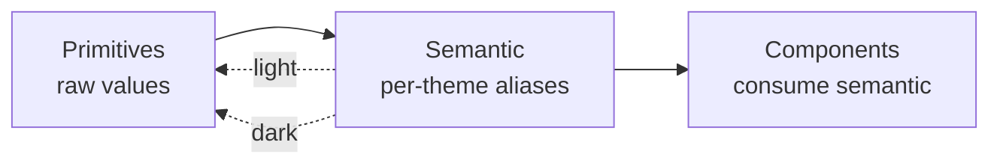

# Token architecture

The full model behind the layers summarized in SKILL.md, plus the default scales used to populate `assets/design-tokens.template.json`.

## Layers

**Primitives** are the palette and scales — every value the system can express, with no opinion about where it's used. They don't change between themes. Naming is mechanical: a ramp (`neutral.0…950`, `accent.50…900`) or a step (`space.4`, `radius.md`).

**Semantic** tokens name *roles*: `bg`, `surface`, `text-primary`, `border`, `accent`, `on-accent`. Each is an alias to a primitive. Light and dark are two complete maps over the same primitives. This is the layer everything else reads.

**Component** tokens (`button.bg`, `input.border`) exist only when a component must diverge from the semantic role. Default to none — adding them early couples the system to UI that doesn't exist yet.

### Why this shape

A component that reads `color.text-primary` instead of `neutral.900` keeps working when the theme flips, because only the semantic→primitive mapping moved. The cost of a new theme is one new semantic map, not edits across the codebase. This is the entire payoff of the indirection — don't collapse it by letting components reach for primitives.

## DTCG format

`design-tokens.json` uses the Design Tokens Community Group shape so it's tool-readable (Style Dictionary etc.):

- Each token: `{ "$value": ..., "$type": "color" | "dimension" | "fontWeight" | "fontFamily" | "number" | "shadow" }`.
- Aliases reference another token by path: `"$value": "{color.neutral.0}"`.
- Groups nest freely; `$type` can sit on a group to apply to its children.

Theme modes aren't first-class in DTCG, so themes live as sibling groups: `semantic.light` and `semantic.dark`, both aliasing into `primitive`.

## Default scales

The concrete values live in `assets/design-tokens.template.json` — that's the source, don't restate the numbers here. This section is the *rationale* behind them; they're conventional, framework-neutral defaults, changed only on request.

### Color primitives

- **Neutral ramp** (`neutral.0…950`): a cool gray scale. `0` = white, `950` = near-black.
- **Accent ramp** (`accent.50…900`): the brand hue. If only a seed (one hex) is given, generate a ramp by adjusting lightness around it; `accent.500/600` should sit near the seed.
- **Status**: `success`, `warning`, `danger`, `info` — one mid-tone each.

### Semantic keys (must exist in both light and dark)

| Key | Role |
|---|---|
| `bg` | page background |
| `surface` | default card/panel fill |
| `surface-raised` | elevated surface |
| `surface-sunken` | recessed surface |
| `text-primary` | body/heading text |
| `text-secondary` | supporting text |
| `text-muted` | placeholder/disabled |
| `border` | default dividers/outlines |
| `border-strong` | emphasized borders |
| `accent` | primary actions, links |
| `accent-hover` | accent hover/active |
| `on-accent` | text/icons on accent fills |
| `focus-ring` | focus indicator |
| `success`/`warning`/`danger`/`info` | status fills |
| `on-status` | text on status fills |

Light maps `bg→neutral.0`, `text-primary→neutral.900`, `accent→accent.600`. Dark maps `bg→neutral.950`, `text-primary→neutral.50`, `accent→accent.500` (one step lighter so it reads on dark). Keep the *keys* identical across themes; only the targets differ.

### Scales (`space`, `radius`, `border-width`, `font`)

Values are in the JSON; the conventions behind them:

- **Spacing** is a 4px-based step scale (`$type: dimension`) — multiples chosen for vertical rhythm, gaps widening past `space.6`.
- **Radius** runs `none → full` (`$type: dimension`); `full` is a sentinel (`9999`) for pills/circles.
- **Border width** is just `thin`/`thick` (`$type: dimension`) — most borders are thin.
- **Typography**: `font.family.sans` (body/UI, system stack unless a brand font is set) and `font.family.mono` (code); a `font.size` step scale in px (`$type: dimension`); `font.weight` named weights (`$type: fontWeight`); `font.line-height` unitless ratios, tighter for headings (`$type: number`).

### Shadow / elevation

`shadow.sm/md/lg` are composite shadows (`$type: shadow`) tuned for light backgrounds. In dark themes shadows read weakly, so the dark theme typically lowers opacity or substitutes a subtle border for elevation. Document whichever choice is made in the card.

## Adding a theme

A new theme is a new sibling under `semantic` (e.g. `semantic.high-contrast`) with the same key set, re-aliased. Adapters then gain one more output map; nothing in component code changes. This is the test of whether the layering held: if adding a theme requires touching components, a primitive leaked through.
