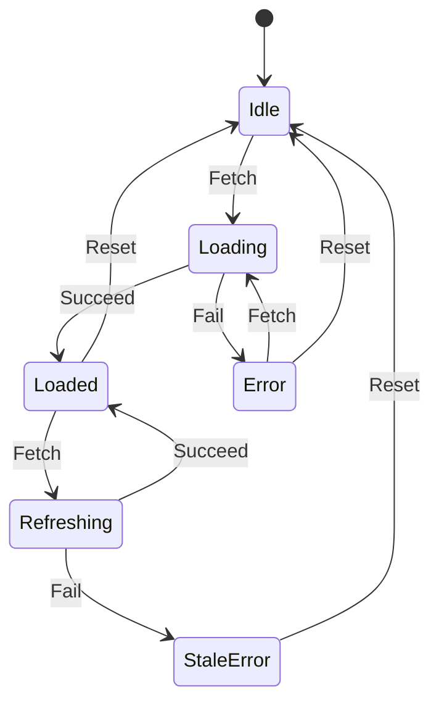

# State Machines (instead of flags)

Boolean flags lie. Three booleans on one entity say "this thing has 8 possible states," but the design only intends 4 of them to be reachable. The other 4 leak in through bugs, race conditions, or callers who forgot to clear a flag. Rather than chase the leaks, **make the illegal states unreachable** by replacing the flags with a single named state and an explicit transition function. Bugs become compile errors or one well-placed runtime rejection, not a thirty-step debugging session.

## When to use

Real smells:

- **3+ booleans on one entity** that describe its lifecycle (`isLoading`, `isError`, `hasData`, `isComplete`, `isCancelled` …).
- **Impossible-but-reachable combinations** — bug reports describe `isLoading=true` *and* `isError=true`, or "stuck in submitting forever."
- **Scattered transitions** — flag flips happen in 12 different callers; nobody can list every place a state changes.
- **Conditional logic with the same shape repeating** — `if (!isLoading && !isError && hasData) …` checked at every render or every handler.
- **Order-dependent workflows** — a process must go `draft → submitted → reviewed → published`, and the code currently enforces this with a tangle of boolean guards.
- **Status field that's actually a state, encoded as a string** — `status: "pending" | "active" | "done"` accessed as a string with no transition rules.

Skip for:

- A single boolean (`isEnabled`) that's genuinely just on/off, no correlated state.
- Independent flags (`isFavorite`, `isPinned`, `isMuted`) that compose freely — they're orthogonal toggles, not states.
- Throwaway scripts.

This skill is complementary to `adt-types`. ADT models the *shape* of each state's data; state machines model the *transitions* between states. For complex lifecycles you usually want both: an ADT for the variants, a transition function for the moves.

## The method

### Phase 1 — List the booleans / status strings

Find every flag on the entity. Write them down with a one-line meaning. Include any "status" / "phase" / "stage" string fields. Don't filter yet — capture all of them.

### Phase 2 — Enumerate reachable combinations

For N booleans there are 2^N combinations. List the ones that are *actually intended*. Cross out the rest. Common patterns:

| isLoading | isError | hasData | Intended? | Name |
|-----------|---------|---------|-----------|------|
| F | F | F | yes | `Idle` |
| T | F | F | yes | `Loading` |
| F | T | F | yes | `Error` |
| F | F | T | yes | `Loaded` |
| T | T | F | **NO** | — |
| T | F | T | maybe | `Refreshing` |
| F | T | T | maybe | `StaleError` |
| T | T | T | **NO** | — |

The "NO" rows are the bugs the boolean encoding was hiding. The "maybe" rows are real design questions: do you allow refreshing after a load? Decide deliberately.

### Phase 3 — Name the states and the events

Give each intended combination a name (the table's right column). Then list the **events** that move between them — `Fetch`, `Succeed`, `Fail`, `Retry`, `Reset`. Events are intentions, not implementation details. They come from user actions, network responses, timers — anything *external* to the state itself.

### Phase 4 — Define the transition table

Spell out, for each (state, event) pair, what the next state is — or that the event is *rejected* in this state. Example:

| from \ event | Fetch       | Succeed | Fail   | Reset |
|--------------|-------------|---------|--------|-------|
| Idle         | Loading     | —       | —      | Idle  |
| Loading      | —           | Loaded  | Error  | Idle  |
| Loaded       | Refreshing  | —       | —      | Idle  |
| Error        | Loading     | —       | —      | Idle  |
| Refreshing   | —           | Loaded  | StaleError | Idle |

Empty cells = illegal in this state. The table is your spec; if it's hard to fill in, the design isn't done yet.

A diagram helps:

### Phase 5 — Encode the machine

Replace the flags with a single `state` field and a `transition(state, event)` function. Idiomatic encodings:

- **TypeScript:** discriminated union for state + a `transition` function that exhaustively switches on `(state.kind, event.kind)`.
- **Rust / Swift / Kotlin:** `enum` with associated values, `match`/`when` over the pair.
- **Python:** `dataclass` per state + `match` (3.10+); or a library like `transitions` for richer machines.
- **Statecharts:** for genuinely complex hierarchical/parallel state, reach for `xstate` (JS), or generate from a `.scxml`. Don't use a heavy library for 4 states.

Two implementation rules:

1. **The transition is the only place state changes.** No other code writes to `state` directly. Mutations go through `transition()`.
2. **Illegal events are rejected, not ignored.** Either return a `Result`/`Either` with an error, throw, or return the unchanged state with a logged warning — pick one and be consistent. Silent no-ops mask bugs.

### Phase 6 — Migrate callers

Replace the old flag flips with `dispatch(event)` calls. Replace `if (isLoading && !isError && …)` with `match (state)`. Delete the flags.

## Output format

Return:

1. **Current flags** — the bag of booleans/strings being replaced.
2. **State table** — intended combinations named, illegal ones called out.
3. **Transition table or mermaid `stateDiagram-v2`** — pick whichever is clearer.
4. **Code skeleton** — state type + `transition` function in the user's language.
5. **Migration notes** — top 3 call sites that flip flags today, rewritten to dispatch events.

## Anti-patterns to refuse

- **String state without a transition function.** A `status: string` field is a state machine in name only — any caller can set it to anything. Wrap mutations in a transition function (or use the `adt-types` skill to hide the field).
- **Allowing every transition.** If `transition` accepts every event from every state, you've just renamed your booleans. The point is the rejections.
- **Hidden side effects in transitions.** Keep the transition function pure: `(state, event) → next state` (and optionally a list of effects to run). Side effects mixed in make the machine impossible to test or replay.
- **Premature statechart library.** A 4-state machine doesn't need xstate, transitions, or akka-fsm. A native enum + switch beats a framework until the machine grows hierarchy or parallelism.
- **One mega-machine for the whole entity.** If you have 14 states and they obviously partition (e.g., a payment lifecycle and a shipping lifecycle on the same order), build two machines and compose them. One machine per concern.
- **Forgetting the terminal state.** Most workflows end (`Cancelled`, `Completed`, `Archived`). Model it explicitly; transitions out of a terminal state should be rejected.

## Quick mode

For a small machine (≤4 states):

1. Named states as a list.
2. Mermaid `stateDiagram-v2` showing transitions.
3. Code: state enum + transition function.

Skip the table-of-combinations step if there are only 2 booleans being collapsed.
