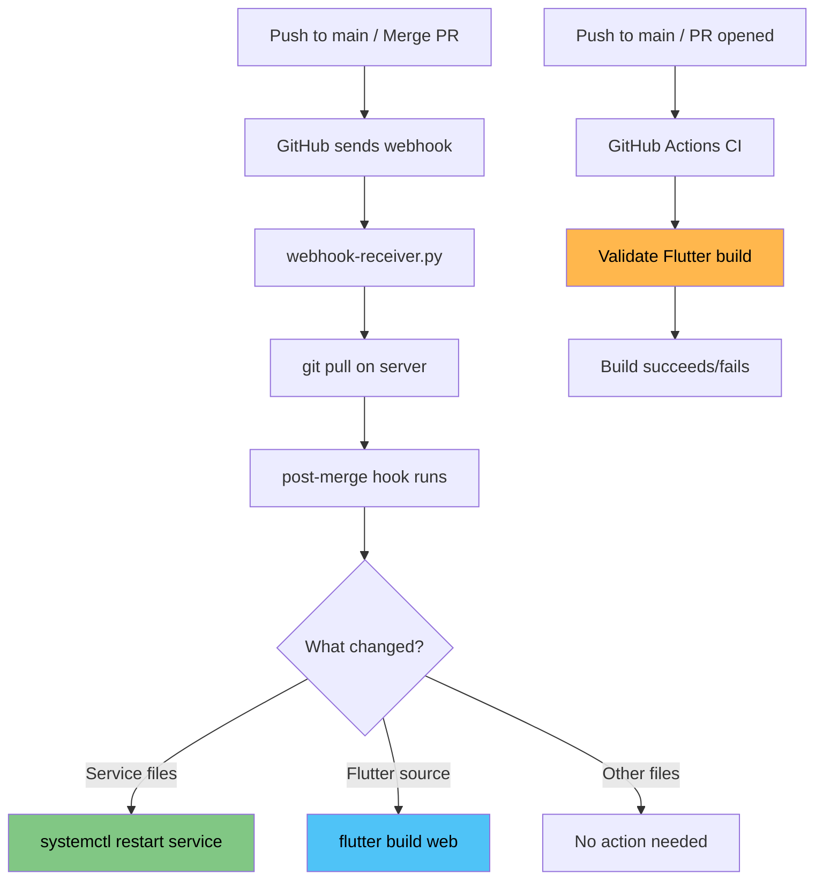

<a href="https://claude.ai"></a>

# VPS Agent Manager

An autonomous AI agent system that turns GitHub issues into code. Open an issue, and a Claude agent picks it up, writes the code, and either merges it directly or creates a PR for review.

Running on `ai.memention.net`.

## How it works

1. Open a GitHub issue describing what you want
2. A webhook fires and the server picks it up
3. A comment is posted on the issue that the agent has started
4. Claude runs in an isolated git worktree, working on the task
5. When done, a PR is created for review
6. The agent posts a summary comment on the issue and closes it

## Architecture

```
GitHub Issue
    │
    ▼
webhook-receiver.py  ◄── nginx reverse proxy (HTTPS)
    │
    ▼
monitor-issues.sh    ◄── fetches issue, creates issue-N.md
    │
    ▼
run-agent.sh         ◄── creates worktree, runs Claude, handles output
    │
    └──► push branch + create PR
```

A post-merge git hook auto-restarts systemd services and rebuilds Flutter web apps when their source files change.

## Deploy pipeline



**Key points:**
- **Build output is not stored in git** — Flutter apps are built on the server after each pull
- **CI is validation only** — GitHub Actions checks that Flutter projects compile, but does not deploy
- The `--base-href /<project-name>/` flag is applied automatically by the post-merge hook
- Adding a new Flutter project requires no workflow changes — any `projects/*/` directory with a `pubspec.yaml` is auto-detected

## Setup

```bash
# One-time server provisioning
sudo bash setup-server.sh

# Create config
cat > .env.issues << 'EOF'
GITHUB_TOKEN=<fine-grained-pat>
GITHUB_REPO=epatel/vps-ai
WEBHOOK_SECRET=<random-secret>
EOF
chmod 600 .env.issues
```

### GitHub token permissions (fine-grained PAT)

- **Issues**: Read and write
- **Pull requests**: Read and write
- **Contents**: Read and write

### Webhook configuration

Add a webhook on the repo:
- **URL:** `https://ai.memention.net/webhook`
- **Content type:** `application/json`
- **Secret:** matches `WEBHOOK_SECRET`
- **Events:** Issues, Pull requests

## Usage

Just open an issue. The agent handles the rest.

```bash
# Manual trigger for a specific issue
bash monitor-issues.sh <issue_number>

# Watch logs
tail -f .issues-monitor.log
tail -f .agent-issue-N.log
```

## Manual setup required

Some things must be configured manually outside of this repo:

### GitHub webhook

In the repo's **Settings → Webhooks**, create a webhook with:
- **URL:** `https://ai.memention.net/webhook`
- **Content type:** `application/json`
- **Secret:** must match `WEBHOOK_SECRET` in `.env.issues`
- **Events:** Select **Issues**, **Pull requests**, and **Pushes** (Issues triggers the agent, Pull requests and Pushes trigger `git pull` + post-merge hook on the server)

### Nginx

Nginx reverse-proxies `/webhook` to the local webhook receiver and serves static project files. The config lives at `/etc/nginx/sites-enabled/ai.memention.net` and must be updated manually when adding new static projects (e.g. a new `location /my-project` alias).

### Systemd service

The webhook receiver runs as a systemd service. See `setup-server.sh` for the service definition. If the service file changes, reload and restart manually:
```bash
sudo systemctl daemon-reload
sudo systemctl restart vps-ai-webhook
```

### GitHub fine-grained PAT

The token in `.env.issues` must be created manually at GitHub → Settings → Developer settings → Fine-grained personal access tokens, with permissions:
- **Issues**: Read and write
- **Pull requests**: Read and write
- **Contents**: Read and write

## Projects

Agent-created projects live under `projects/`. Services are managed via systemd — add entries to `hooks/post-merge` to auto-restart on deploy.

| Project | Description |
|---------|-------------|
| [asteroids](projects/asteroids/) | Multiplayer Asteroids arcade game with WebSocket networking |
| [badge](projects/badge/) | E-paper badge designer/writer over BLE |
| [breakout](projects/breakout/) | Classic Breakout brick-breaker game (single-page HTML) |
| [flutter_demo](projects/flutter_demo/) | Flutter web demo app |
| [poem](projects/poem/) | A poem about working with AI |
| [scramble](projects/scramble/) | Vectrex-style arcade flight shooter with terrain and enemies |
| [status-page](projects/status-page/) | Server status dashboard (Python + systemd service) |
| [todo-api](projects/todo-api/) | REST API for todos with JWT auth (Python/Flask) |
| [todo-app](projects/todo-app/) | Flutter web frontend for the todo API |
| [trumps48hours](projects/trumps48hours/) | Sci-fi countdown timer with particle effects |
