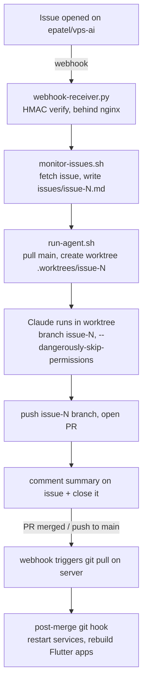

# architecture

How the GitHub-issue-driven autonomous agent system fits together end to end, and its deployment shape.

The system turns a new GitHub issue on `epatel/vps-ai` into a reviewed PR, then deploys merged changes. It runs on `ai.memention.net` (Ubuntu 24.04, x86_64).

## Pipeline



Steps 6/7: a comment is posted when the agent starts; after it finishes the `issue-N` branch is pushed and a PR opened for review. The agent's summary is posted as a comment and the issue is closed.

## Components

| File | Role |
|---|---|
| `webhook-receiver.py` | HTTP webhook server (behind nginx); validates HMAC, dispatches events |
| `monitor-issues.sh` | Fetches issue from GitHub, writes `issues/issue-N.md`, spawns the agent |
| `run-agent.sh` | Pulls `main`, creates the worktree, runs Claude, pushes branch + opens PR |
| `github-helper.py` | GitHub API helper (comments, PRs, close) |
| `post-progress.sh` | Lets running agents post progress to the issue |
| `hooks/post-merge` | Restarts services + rebuilds Flutter apps when their files change |
| `setup-hooks.sh` | Installs git hooks from `hooks/` |
| `setup-server.sh` | One-time server provisioning |
| `.system-prompt.md` | System prompt given to every agent |
| `.env.issues` | Config (gitignored) |
| `issues/` | Issue tracking files (`issue-N.md`) |
| `projects/` | Project directories (apps, games, services) |
| `.worktrees/` | Temporary agent worktrees (gitignored) |

## Services / systemd

Services run under systemd. The `post-merge` hook restarts a service when its
project files change on merge/pull. To add a service, edit `hooks/post-merge`
and add an entry to `SERVICE_MAP`:

```bash
["projects/my-project"]="my-service"
```

Then run `bash setup-hooks.sh` to reinstall the hook.
