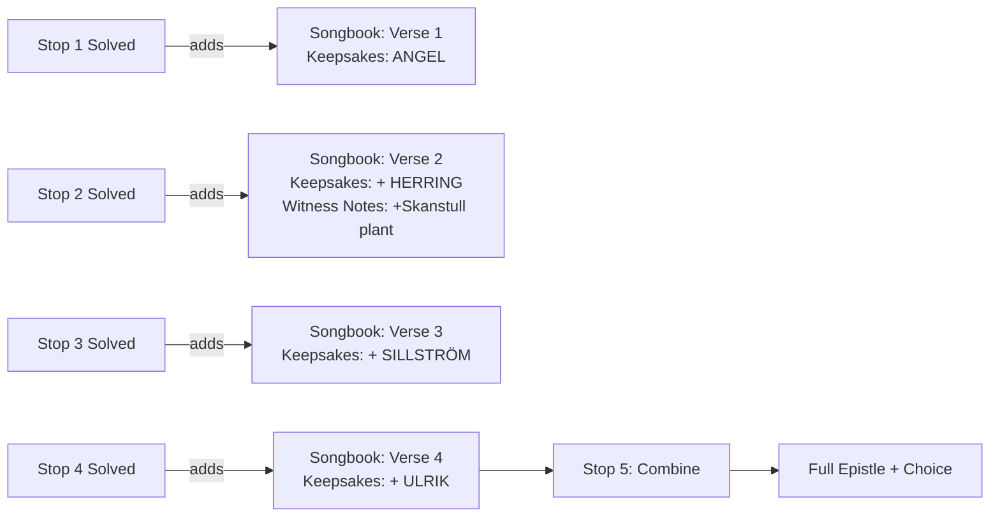

# Bellman's Lost Epistle — Puzzle Design Document

> Companion to `STORY_BIBLE.md`. This document is the design contract for the five
> in-app puzzles that gate progress between pubs. The narrative voice and verse
> text are canon and pulled from the bible — do not paraphrase.

---

## 0. Design Principles

A reminder before the specs, so every puzzle gets sanity-checked against this list.

| Principle | What it means in practice |
|---|---|
| **Light & social** | Solvable by a group after a few beers. No pen, no paper, no Googling. |
| **Phone-native** | Tap, drag, type a short answer. No keyboards-of-doom, no precise gestures. |
| **Variety per stop** | Each of the five stops uses a *different* puzzle mechanic. |
| **Story-fed** | Every puzzle's content comes from the verse / witness / pub at that stop. |
| **Failure-safe** | Two progressive hints, then a "reveal" so the night never stalls. |
| **Pub-aware** | At least one stop forces players to look up from the phone at the room. |
| **Cumulative finale** | Stop 5 cannot be solved without something carried forward from each prior stop. |

### Puzzle mechanic matrix (no repeats)

| Stop | Pub | Mechanic | Phone interaction |
|---|---|---|---|
| 1 | Engelen | **Trivia + observation** | Multiple-choice tap |
| 2 | Wirströms | **Verse reordering** | Drag-to-reorder lines |
| 3 | Monks Porter House | **Heraldry / visual ID** | Tap the right shield |
| 4 | Akkurat | **Acrostic cipher decode** | Type a 7-letter word |
| 5 | Kvarnen | **Combine clues from all prior stops** | Fill-in-the-blank verse |

### Reward economy

Each stop yields **one "verse fragment" added to the player's in-app songbook**, plus one **"keepsake clue word"** they will need later. The keepsake words are:

| Stop | Keepsake word | Used at Stop 5? |
|---|---|---|
| 1 | `ANGEL` | ✗ (flavor only) |
| 2 | `HERRING` | ✓ (slot in Verse 5 puzzle) |
| 3 | `SILLSTRÖM` | ✓ (the family name slot) |
| 4 | `ULRIK` | ✓ (the given name slot) |
| 5 | `SKANSTULL` (revealed) | finale |

The app should silently "save" each keepsake as the puzzle is solved, so Stop 5 can pre-fill word banks without forcing players to remember anything.

---

## STOP 1 — Engelen

**Witness:** Jean Fredman · **Beat:** Prologue & Recruitment · **Mechanic:** Trivia + observation

### 1. Story segment shown to players

After the QR scan, the screen shows a sepia-toned "scrap of paper" with Fredman's prologue, exactly as in the bible (§5, Stop 1). Card transitions to **Verse 1**:

> *In Engelen's hall, where the night is sung,*
> *I leave the first of five — where the angel's hung.*
> *Drink deep, and listen — under candle's tongue:*
> *The masked one's name is buried in this song.*

Then a tap-to-continue prompt: **"Fredman taps his glass. He has one question for you before he tells you where Mollberg drinks…"**

### 2. Puzzle

A two-step warm-up. Both steps are intentionally *easy* — the goal is to teach the loop (read → answer → unlock), not to challenge.

**Step A — Bellman trivia (multiple choice).**
> *"How many epistles did my master Bellman publish in his lifetime?"*
>
> &nbsp;&nbsp;◯ 12  &nbsp;&nbsp;◯ 50  &nbsp;&nbsp;● **82**  &nbsp;&nbsp;◯ 100

(Correct answer is 82. Wrong answers get a Fredman-voiced quip — "*Generous, friend, but no.*" — and let the player retry. No penalty.)

On correct answer Fredman replies: *"Eighty-two — and tonight, you and I shall make it eighty-three. Now look about you."*

**Step B — Observation.**
> *"My verse names a thing watching this very room. Find it. Tap it."*

The phone shows **four photos** taken inside Engelen:

1. The candle on the table
2. The **angel above the bar** ← correct (Engelen's namesake — *engelen* / *ängeln* = "the angel")
3. A wooden ceiling beam
4. A fiddle on the wall

The "angel" reference is the verse's pun on the pub's name (bible §5, Stop 1). Players physically look up, identify the angel, tap the photo.

### 3. Answer & unlock

Correct sequence: **82 → angel photo**.

On success the app:
- Saves Verse 1 to the **Songbook** tab.
- Displays the keepsake: **`ANGEL`** (with a small icon).
- Reveals the next-stop card:

> *"Find the next where Mollberg cracked his cup —*
> *under the vault, on Stora Nygatan, where the blues now plays."*
>
> **Next stop: Wirströms Pub · Stora Nygatan 13 · ~3 min walk**
> [Open in Maps]   [I'm there — scan QR]

### 4. Hint system

| Tap | Hint shown | What it does |
|---|---|---|
| 🪶 Hint 1 | *"Fredman wrote 82, but tonight there will be one more — and that's why we're here."* | Nudges toward 82. |
| 🪶 Hint 2 | *"Verse 1, line 2: 'where the angel's hung.' What is hung in this room that gives the pub its name?"* | Almost gives Step B. |
| 🗝️ Reveal | *Highlights the correct answer.* | Last-resort, no shame. |

### 5. Location-specific elements

- **Angel imagery** in the room — the pub's name is its motif; expect a hanging angel above the bar or on the signage. Verifiable on-site.
- The candle on the table is part of the photo set — implicit reference to *"under candle's tongue"* in the verse.
- A flavor-only line shown after success: *"Bellman never drank here — Engelen postdates him by a century or so — but he'd have liked the angel. He had a soft spot for fallen ones."*

---

## STOP 2 — Wirströms Pub

**Witness:** Corporal Mollberg · **Beat:** First Clue — the Red Coat · **Mechanic:** Verse reordering

### 1. Story segment shown to players

Players have descended to the cellar. The phone displays a torn-edge "playing card" with Mollberg's monologue (bible §5, Stop 2) verbatim, ending in his characteristic boast:

> *"…and I kept the verse, friends. But damn me — I've been drinking on credit*
> *and I've muddled the lines. You sort it. I never could read sober anyway."*

### 2. Puzzle

**Drag-to-reorder.** The four lines of Verse 2 are presented in scrambled order as draggable cards. Players reorder them to reform the verse.

**Scrambled order shown:**

```
[ He paid in gold, that brother of the masque —     ]
[ Beneath the vault, where Mollberg cracked his cup, ]
[ The second clue: a herring on his flask.           ]
[ A red coat passed, then bowed, then bottomed up.   ]
```

**Correct order** (matches bible §6):

1. *Beneath the vault, where Mollberg cracked his cup,*
2. *A red coat passed, then bowed, then bottomed up.*
3. *He paid in gold, that brother of the masque —*
4. *The second clue: a herring on his flask.*

Why this works after three beers:
- Only 4 lines = 24 permutations, but the **AABB rhyme** (`cup/up`, `masque/flask`) acts as a guide-rail. Anyone hearing the meter aloud will feel the wrong order.
- Mollberg's narrative voice ("the night the king fell, I was here") establishes the chronology: location → arrival → action → clue.
- Reading the lines aloud is exactly the right pub behaviour. Encourage it: a small UI hint reads *"Try reading them aloud. Mollberg always did."*

### 3. Answer & unlock

When the order is correct, the four cards "snap" into a parchment scroll, the verse animates into the Songbook, and the keepsake **`HERRING`** appears.

> *"There. As I sang it, more or less. Now go and find Movitz — he's wheezing*
> *out his last confession by the water, hard by the kings."*
>
> **Next stop: Monks Porter House · Munkbron 11 · ~4 min walk**

### 4. Hint system

| Tap | Hint shown | What it does |
|---|---|---|
| 🪶 Hint 1 | *"Mollberg starts where he is — in the cellar. Then someone arrives. Then they pay. Then they leave a clue."* | Maps narrative beats to lines. |
| 🪶 Hint 2 | *"The rhymes pair up: a line ending in 'cup' must be followed by one ending in 'up'."* | Gives the AABB structure. |
| 🗝️ Reveal | *Animates the correct order.* | |

### 5. Location-specific elements

- Puzzle is gated to the **cellar level** — the QR code lives only down the spiral stair, ensuring players physically descend.
- **Live blues** on most nights matches the verse line *"under the vault…where the blues now plays"* from Stop 1's hint. If music is playing, a flavor toast fires: *"Mollberg approves. He liked anything loud."*
- The cellar's 17th-century vaulted stonework is real (bible §5, Stop 2 historical note) — a one-line "Did you know?" appears post-solve to reinforce the IRL/in-game fusion.

---

## STOP 3 — Monks Porter House

**Witness:** Father Movitz · **Beat:** Identification — the Coat of Arms · **Mechanic:** Heraldic visual ID

### 1. Story segment shown to players

A "manuscript" card — illuminated, gilt-edged, mock-medieval calligraphy, fitting the pub's monastic theme (bible §5, Stop 3). Movitz delivers his confession, ending in a cough:

> *"…three silver fish on a field of midnight. Sill. Herring. The house of Sillström.*
> *…cough… You'll know the arms when you see them. I drew them once, on a coaster.*
> *I drew several. Damned if I can remember which one was right."*

A small flavor line nudges players to lift their gaze: *"Look across the water. The kings are sleeping over there."*

### 2. Puzzle

**Tap the right shield.** The phone shows a 2×2 grid of four hand-drawn-style coats of arms:

| | |
|---|---|
| **A.** Two gold lions on red | **B.** Three silver herrings on black ← correct |
| **C.** A crown above a sword on blue | **D.** Three gold herrings on white |

Distractors are calibrated for a slightly tipsy group:

- **A** is plausibly noble but wrong colours, wrong creature.
- **C** is regal-feeling — tempting if players are over-thinking ("the king!").
- **D** is the sneaky one — right creature, right number, **wrong colours**. Forces the players to actually re-read the verse: *"Three silver fish on field of midnight."* Midnight = black. Silver ≠ gold.

This rewards close reading without being a memory test — Verse 3 is on screen the whole time.

### 3. Answer & unlock

Tap shield **B**. The shield enlarges, the family name reveals on a banner: **HOUSE SILLSTRÖM** (with the *sill* = herring etymology shown in small print — fun for the linguistically curious).

The keepsake **`SILLSTRÖM`** locks into the player's clue tray.

> *"…cough… Now go to her. Ulla is across the bridge. She has the half of this*
> *story I never dared write down."*
>
> **Next stop: Akkurat · Hornsgatan 18 · ~12 min walk over Slussen**

The longer walk between Stops 3 and 4 is intentional — geographically and emotionally pivots the night onto Söder, per bible §4.

### 4. Hint system

| Tap | Hint shown | What it does |
|---|---|---|
| 🪶 Hint 1 | *"Re-read Verse 3. Movitz says **silver** fish on **midnight**. What colour is midnight?"* | Eliminates option D's gold. |
| 🪶 Hint 2 | *"Three. Silver. On black. Two of these shields are even close."* | Narrows to B vs D. |
| 🗝️ Reveal | *Highlights shield B and dims the rest.* | |

### 5. Location-specific elements

- **Window view of Riddarholmskyrkan.** Post-solve, the app shows a small map graphic: *"Out the window, across the water — that spire is Riddarholmskyrkan, where Gustav III is buried since 1792. You are looking at the actual grave of the king Bellman served. Salute him with your next sip."*
- The pub's monastic theme is mirrored in the manuscript visual styling.
- **Sill** (Swedish for herring) is shown alongside Sillström — a little linguistic gift for the table that pays off the heraldry pun.

---

## STOP 4 — Akkurat

**Witness:** Ulla Winblad · **Beat:** Heart — the Lover's Confession · **Mechanic:** Acrostic cipher decode

### 1. Story segment shown to players

Per bible §5, Stop 4: at the bar, a small glass of **Swedish punsch** is delivered to the table (production-side detail). On the phone, Ulla's letter appears in a soft handwriting font — pale ink, slight tear at the bottom:

> *I knew him, friends. Don't pretend to be shocked.*
> *…* (full letter from bible) *…*
> *Ulrik. His name was Ulrik.*
> *…*
> *Sing my verse last, or sing it never. Either is mercy.*
> *— Ulla*

Then **Verse 4** is added to the Songbook automatically (the keepsake `ULRIK` is awarded just for arriving — it is *spoken plainly* by Ulla; we don't make players guess a name she literally tells them).

But the verse hides one more secret. Ulla, after pressing her palm to the table, adds a postscript:

> *"He gave me this once, in his own hand. I never could read it sober.*
> *Perhaps you can. The answer is where you must go next."*

### 2. Puzzle

**Acrostic cipher.** The phone displays a four-line stanza in Bellman's voice — styled to look like a fragment of *Epistel N:o 71* ("Ulla, min Ulla"), the song that the full Epistle 83 will be sung to (bible §6).

Seven letters in the stanza are circled. Read in order, they spell the name of the next pub.

```
   K linger the bells, and lanterns shine bright,
   Soft falls the dust on the V iolet night,
   A way to the mill where the millerA  sings,
   While the R iver beneath us its silver brings.
   And N orth of the bridge, where the bottle sweetly rings,
   E ach toast leads us further from a kingdo m of N ames…
```

(Production note: the actual highlighted letters in order spell **`KVARNEN`** — Swedish for *"the mill."* The literal lyric isn't real Bellman; it's pastiche, but evokes Epistel 71's pastoral imagery.)

The phone shows the stanza with the seven letters visually emphasized (circle, slightly enlarged, gilt). A text input appears below: *"Read the gilded letters. Where does Ulla send you?"*

Players type **KVARNEN** (case-insensitive; "kvarnen", "Kvarnen", "KVARNEN" all accepted, plus accept "the mill" as alt with a wink: *"Yes — that's what it means. Type the Swedish name."*)

### 3. Answer & unlock

On correct entry, the gilt letters **fly off the page** and rearrange to spell `KVARNEN` above a sketch of a windmill. Ulla's voice (or text card):

> *"Yes. The mill on Söder. Where Bellman sang loudest, and where the song,*
> *if it is to be sung at all, must be sung. Go on. I'll wait here, with the punsch."*
>
> **Next stop: Kvarnen · Tjärhovsgatan 4 · ~9 min walk**

### 4. Hint system

| Tap | Hint shown | What it does |
|---|---|---|
| 🪶 Hint 1 | *"Read only the gilded letters, in order, top to bottom."* | Re-states the rule for anyone who missed it. |
| 🪶 Hint 2 | *"It's a famous beer hall on Söder. Seven letters. Starts with K."* | Almost free. |
| 🗝️ Reveal | *Auto-fills `KVARNEN` and continues.* | |

### 5. Location-specific elements

- **Swedish punsch ritual.** A line reads: *"That small glass on your table — that is punsch. Bellman drank it nightly. Toast Ulla before you continue."* Production-side, the bartender is briefed (bible §5, Stop 4).
- **The slow pivot to Söder.** A short flavor card after the puzzle: *"You've crossed Slussen. The medieval lanes are behind you. From here, the night is louder — and shorter."*
- **The melody hint.** Post-solve, an optional "play preview" button surfaces a 10-second clip of *Epistel N:o 71*'s melody, foreshadowing the finale's sung delivery.

---

## STOP 5 — Kvarnen

**Witness:** Carl Michael Bellman himself · **Beat:** Reveal & Reconstruction · **Mechanic:** Combine all prior clues

### 1. Story segment shown to players

The phone displays a **fold-out broadside** styled as an 18th-century playbill, headed:

> ## *Fredmans Epistel N:o 83*
> ### *Till Ulla, om en förrädare*

The four already-collected verses scroll in, then settle. Bellman's voice — small, italic, almost murmured:

> *"You have brought me four verses, friends. The fifth I never finished —*
> *I lost the words at the bottom of one too many cups. Help me end it.*
> *You have all you need. Look at what you carried here."*

The player's **clue tray** opens automatically along the bottom of the screen, showing the four keepsakes earned: `ANGEL`, `HERRING`, `SILLSTRÖM`, `ULRIK`. (`ANGEL` is decorative — a Chekhov's gun that doesn't fire, deliberately, because not every collected thing needs to matter. Players who notice will feel clever.)

### 2. Puzzle

**Fill-in-the-blank Verse 5.** The screen shows Verse 5 with **four blanks**, each tagged with the stop where its answer was earned. Players drag keepsakes from the tray into the right slots.

Final form Verse 5 (bible §6, with blanks marked `[___]`):

```
And so — the masked one bore the name I dread:
Baron [_____①_____]. [_____②_____]. Now he, too, is dead —
Fell from his horse near [_____③_____], so they said.
(I do not ask who pushed. I drink instead.)

His coat was red, his flask bore a [_____④_____] —
Carl Michael writes, then drinks, then writes again —
Bury this verse, or sing it, gentlemen.
```

| Slot | Tag | Correct keepsake | Source |
|---|---|---|---|
| ① | *family name (Stop 3)* | `SILLSTRÖM` | Stop 3 |
| ② | *given name (Stop 4)* | `ULRIK` | Stop 4 |
| ③ | *place of his death* | `SKANSTULL` | **new** — see below |
| ④ | *the heraldic creature (Stop 2)* | `HERRING` | Stop 2 |

Slot ③ is the one new fact. It's planted earlier in the night — Mollberg grumbles about it in passing at Stop 2 (*"…some say he fell from his horse near Skanstull. I say a horse never threw a Sillström unless a Sillström deserved it."*) — and it's also visible in the player's "Witness Notes" archive, which has been silently building all night. The puzzle therefore *rewards* groups who paid attention earlier without *requiring* perfect recall — Skanstull is also the only word in the keepsake bank that wasn't used yet.

The unused `ANGEL` keepsake stays in the tray. If a player tries to drop it into a slot, a Bellman line fires: *"No, no — that was where we began, not where we end."*

### 3. Answer & unlock

When all four slots are correct, the verse closes itself. The full reconstructed Epistle (all five verses, bible §6) animates into the Songbook as a single document. Then the **player choice** screen appears, exactly as in bible §5, Stop 5:

> ### *"Sing it, or bury it?"*
>
> **🎵 Sing it.** The full epistle plays as audio — set to *Epistel N:o 71*'s melody — with on-screen lyrics karaoke-style. The ghosts are dispersed; the song is finally public after 231 years.
>
> **🕯️ Bury it.** A folding-paper animation closes the broadside. Ulla's voice: *"Thank you, friends."* The song stays a secret.

Either choice ends with the closing line, in Bellman's faint voice:

> *"Drick ur ditt glas — se Döden på dig väntar. And so do I, friends. And so do I."*

The app surfaces a **Skål** screen with a final *"Take a group selfie?"* option, the route map of the night, and a small "Share" affordance. End state.

### 4. Hint system

| Tap | Hint shown | What it does |
|---|---|---|
| 🪶 Hint 1 | *"Each slot is tagged with the stop where you earned its answer. Open your clue tray."* | Re-explains the loop. |
| 🪶 Hint 2 | *"Slot ③ — Mollberg muttered something about a horse. Open your Witness Notes from Stop 2."* | Surfaces the Skanstull plant. |
| 🗝️ Reveal | *Auto-fills incorrect slots. The choice screen still fires — the ending is yours.* | The night never stalls. |

### 5. Location-specific elements

- **Communal table experience.** Kvarnen's long shared tables are perfect for the verse-assembly moment; the phone UI should support **landscape mode** so the broadside can be read across the table by 3–6 players.
- **Loud room.** Audio playback ("Sing it") needs **subtitles enabled by default** — Kvarnen is loud enough that pure audio will be lost.
- **The Bellman portrait.** Most Stockholm pubs have one somewhere; if Kvarnen does not have a visible Bellman, the app shows a small portrait card during the closing toast, captioned: *"He died poor and beloved, on 11 February 1795. He was 54. Pour one out."*
- **Skanstull's geographic meaning** — about 20 minutes' walk further south of Kvarnen — is mentioned only narratively. The game ends here; players can choose to wander on, or not.

---

## 7. Cross-cutting Notes for the Web App Implementation

### App-side state to maintain across stops



The **Songbook** and **Clue Tray** are persistent UI tabs accessible from any stop.

### Standard puzzle-screen anatomy

Every stop's puzzle screen follows the same layout, so muscle memory is preserved across the night:

1. **Witness header card** — portrait silhouette + name + pub name
2. **Story segment** — scrollable, themed per character (sepia for Fredman, parchment for Mollberg, illuminated for Movitz, soft handwriting for Ulla, broadside for Bellman)
3. **The verse** — added to Songbook on solve
4. **Puzzle area** — varies per stop, see specs above
5. **Hint button** — bottom right, always visible
6. **Submit / continue** — bottom centre

### Failure handling

There is no "wrong answer" punishment. Every wrong submission gets a **witness-voiced quip** and lets the player retry immediately. Three wrong attempts surfaces Hint 1 automatically. Six surfaces Hint 2. Nine surfaces Reveal. **The night never stalls.**

### Accessibility

- All audio captioned by default.
- All puzzles solvable by tap / drag / short typing — no time limits.
- High-contrast mode toggle in settings (the parchment styling can be hard to read in dim pubs at midnight).
- The verses themselves are added to a "Plain text" tab in the Songbook for screen-reader use.

---

## 8. Open production questions for the web-app implementation track

Carried forward from `STORY_BIBLE.md` §9 and refined here:

- **Photo set for Stop 1's observation puzzle** must be shot on-site at Engelen. Four photos, consistent lighting, the angel motif clearly visible (sign, fixture, or wall art — whichever Engelen actually has on the night).
- **Heraldic shields for Stop 3** must be illustrated (4 shields, hand-drawn-feel, visually consistent set).
- **Pastiche stanza for Stop 4** — needs sign-off; the stanza in this doc is a placeholder. A native Swedish writer should polish the pastiche so the gilt letters spell `KVARNEN` cleanly without forcing awkward word choices.
- **Audio for Stop 5's "Sing it" branch** — record (or license) a vocal performance set to *Epistel N:o 71*'s melody, with the full reconstructed Epistle 83 lyrics. ~2 minutes runtime.
- **Witness Notes archive** — implementation needs to silently log each witness's full transcript to a "Notes" tab so the Skanstull plant from Stop 2 is retrievable at Stop 5.

---

*Skål.*
