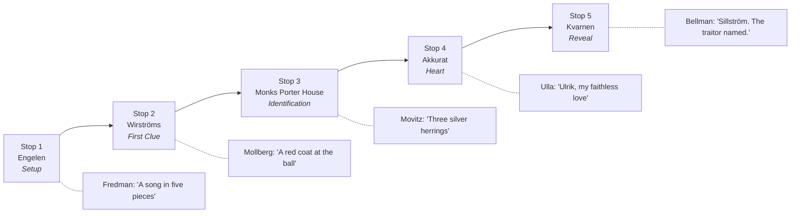

# Bellman's Lost Epistle — Story Bible

> *"Drick ur ditt glas, se Döden på dig väntar..."*
> *"Drink up your glass — see, Death awaits you..."*
> — Fredman's Song No. 21, Carl Michael Bellman

A walking mystery game across five Stockholm pubs, retracing the haunts of Sweden's drunken poet-laureate to recover a song that history almost lost.

---

## 1. Pitch (the elevator version, half a beer in)

It's 1795. Carl Michael Bellman lies dying in poverty. His patron, King Gustav III, was shot at a masked ball three years before. Bellman, who knew everyone in Stockholm — every nobleman, every harlot, every drunk — knew something the official inquiry missed: the assassins had a *financier*, a nobleman whose name was scrubbed from the record.

He couldn't publish what he knew. He'd be killed, or worse, his beloved Ulla Winblad would be ruined. So he did what a poet does: he wrote it into a song. **The 83rd Epistle.** Then he tore it into five verses and hid each one in a tavern he loved, trusting that someday the right kind of drunkard would put it back together.

That's tonight. That's you.

---

## 2. The Central Mystery

### What the players are recovering
A **lost song in five verses** — *Fredmans Epistel N:o 83*, "Till Ulla, om en förrädare" ("To Ulla, concerning a traitor"). Each verse is one piece of an acrostic / cipher that, when assembled at the final pub, names the secret financier.

### What the song reveals
Three secrets, in escalating order across the route:
1. **Stop 1–2:** A "brother in a red coat" was at the masked ball — not on the official list of conspirators.
2. **Stop 3:** His coat of arms — *three silver herrings on a black field* — points to a specific noble house: **Sillström.**
3. **Stop 4–5:** His given name is **Ulrik.** And Ulla Winblad was his lover before she was his witness.

**The reveal:** Baron Ulrik Sillström financed the assassination of Gustav III, escaped justice because of his marriage ties to the regency, and died two months later in a "fall from a horse" near Skanstull — which Bellman strongly hints was no accident. The 83rd Epistle is half love letter, half indictment, and entirely a scandal that the Sillström family spent a century burying.

### Why it matters in 2026
It doesn't, particularly. That's the point — this is a *charming ghost story*, not a *thriller*. The reward isn't justice; it's the song itself, sung at last, two centuries late, by five people slightly drunk on a Tuesday.

---

## 3. Cast of Characters

Bellman's *Fredmans Epistlar* (1790) is populated by a recurring fictional cast — Stockholm's lovable lowlifes. We use them as the **ghost-witnesses**, one per pub, each guarding a verse.

### The Witnesses

| Character | Bellman's original | Our role | Pub |
|---|---|---|---|
| **Jean Fredman** | A real, ruined watchmaker turned drunken philosopher; the Epistles' nominal narrator | The **Prologue Ghost.** Sets the rules; gives the players their first verse and a riddle. Sardonic, wheezy, somehow always pouring. | Engelen |
| **Corporal Mollberg** | Quarrelsome dancing master, cardplayer, brawler | The **Brawler.** Hid Verse 2 in the cellar after a knife fight. Boastful, contradicts himself, may have lied about half of it. | Wirströms Pub |
| **Father Movitz** | Bassoonist, perpetually consumptive, sentimental | The **Confessor.** Saw the financier with his own eyes. Wants absolution. Coughs through his testimony. | Monks Porter House |
| **Ulla Winblad** | A "nymph," half-courtesan half-goddess; based on the real Maria Kristina Kiellström | The **Heart.** Loved the traitor. Her verse is the only one in the first person — a love letter and a confession. | Akkurat |
| **Carl Michael Bellman himself** | The poet | The **Reveal.** Appears (in voice / candle / song) at Kvarnen as the verses are reassembled. Toasts the players, sings the completed epistle, vanishes. | Kvarnen |

### The Antagonist (off-stage)

**Baron Ulrik Sillström** (fictional) — financier of the conspiracy. Never appears on stage; only the verses describe him. His house arms, name, and fate emerge piece by piece.

### Tone notes for character voice

- **Fredman** speaks in mock-grandiose alcoholic philosophy. Latinate jokes. "Ah, but the *clepsydra* of the soul, friends, is filled with brandy and leaks."
- **Mollberg** is loud, performative, half a fight away from a song. "I struck him! I struck him *twice*, the cur — well, the second time he was already on the floor, but a man must be thorough."
- **Movitz** is wheezy, sentimental, quotes scripture between coughs. Asks for water, is given aquavit, accepts gracefully.
- **Ulla** is teasing, melancholy, never says exactly what she means. The only character who is genuinely sad. Players should leave Akkurat slightly in love with her.
- **Bellman** himself is barely there — a candle, a fiddle, a final verse. He doesn't deliver the reveal in prose; he *sings* it.

---

## 4. The Narrative Arc

The arc moves geographically from Gamla Stan's medieval lanes, across the bridges of Riddarholmen, and over Slussen onto Södermalm — mirroring the song's emotional descent from playful riddle, into grave royal territory, into private heartbreak, into the boisterous resolution of a Söder beer hall.

### Five-act structure (one act per pub)

1. **Prologue / Hook** — players are recruited by Fredman's ghost
2. **Rising action** — the conspiracy is sketched in fragments (red coat, herrings)
3. **Midpoint pivot** — the political becomes personal (Movitz's confession)
4. **Emotional climax** — Ulla's verse reframes the whole song as a love letter
5. **Resolution** — the verses combine, the name is spoken, the song is sung, the ghosts disperse

---

## 5. Per-Stop Narrative Beats

Each stop should run **20–35 minutes** of pub time. The "verse" given at each stop is the literary payload; the "beat" is the social/play structure around it.

---

### STOP 1 — Engelen
**Address:** Kornhamnstorg 59B, Gamla Stan
**Atmosphere:** A long-running Gamla Stan pub on the Kornhamnstorg waterfront — wood-panelled, candlelit, casual, with live music most evenings. A genuine drinking-pub register that mirrors the rest of the route.
**Witness:** Jean Fredman
**Beat:** *Prologue & Recruitment*

#### Story

Players are seated at a corner table. A waiter (or a prop, depending on production) slides a coaster across the table — yellowed paper, slightly singed. On it, in a cramped 18th-century hand:

> *Friends — if you read this, the wine has chosen you.*
> *I am Fredman, dead these many years, and yet thirsty.*
> *My master Bellman left a song in five pieces, scattered*
> *like teeth across the city. The first piece is yours.*
> *Find the next where Mollberg cracked his cup —*
> *under the vault, on Stora Nygatan, where the blues now plays.*

Then, the **first verse**, written below:

> *In Engelen's hall, where the night is sung,*
> *I leave the first of five — where the angel's hung.*
> *Drink deep, and listen — under candle's tongue:*
> *The masked one's name is buried in this song.*

#### Game function
- Establishes the rules (5 verses, 5 pubs, reassemble at the end)
- Introduces "the masked one" — players will spend the night learning who
- The reference to "the angel" is a soft hint pointing at Engelen's namesake imagery (the pub name *Engelen* = "the angel" in older Swedish; a hanging angel motif is verifiable in the room — players physically look up and spot it)

#### Historical note
Engelen has no documented Bellman connection — but it has been a beloved Stockholm music pub for decades, and its name (*Engelen*, "the angel") gives the prologue verse its pun. Bellman is buried a short walk away, in Klara cemetery; the proximity is incidental but worth a toast.

---

### STOP 2 — Wirströms Pub
**Address:** Stora Nygatan 13, Gamla Stan
**Atmosphere:** Bar-level is unremarkable Irish-style; the **cellar** is 17th-century vaulted stone, low-lit, hosts live blues most nights.
**Witness:** Corporal Mollberg
**Beat:** *First Clue — the Red Coat*

#### Story

Down the spiral stair into the cellar. The blues band (or a soundtrack, if no live music) underscores the scene. Mollberg's "voice" — delivered via a hidden card, a coaster, a recorded message, or a costumed actor depending on production — recounts:

> *Hear me — I, Corporal Mollberg, never lie except when I'm winning.*
> *The night the king fell, I was here, in this very vault, drinking on credit.*
> *A man came down — red coat, gold buttons, mask still on his face.*
> *He paid for the whole table in gold, told a joke about Frenchmen,*
> *and dropped a flask. On the flask: a fish. Three of them, silver, on black.*
> *He left before the song ended. I kept the flask. I kept this verse.*

**Verse 2:**

> *Beneath the vault, where Mollberg cracked his cup,*
> *A red coat passed, then bowed, then bottomed up.*
> *He paid in gold, that brother of the masque —*
> *The second clue: a herring on his flask.*

#### Game function
- Introduces the *coat of arms* motif — three silver herrings on black
- Players don't yet know which house this is (deliberate)
- Sets up Stop 3, where the heraldry is decoded
- Mollberg is unreliable — the "joke about Frenchmen" is a red herring red herring

#### Historical note
Wirströms has occupied this address since the 1940s, but the cellar vaults are genuinely 17th-century. Mollberg the character is fictional; *cellar brawls* on this street are not.

---

### STOP 3 — Monks Porter House
**Address:** Munkbron 11, Gamla Stan (the western waterfront, facing Riddarholmen)
**Atmosphere:** Belgian-monastic theme, deep beer list, dim lighting. The view across the water is of Riddarholmskyrkan — where Gustav III is buried.
**Witness:** Father Movitz
**Beat:** *Identification — the Coat of Arms*

#### Story

The pub's monastic theme is leaned into: Movitz "appears" via a manuscript tucked into a beer menu — illuminated, gilt-edged, in mock-medieval calligraphy. He addresses the players as a confessor would penitents:

> *Bless you, friends. Movitz here — bassoonist, sinner, dying these forty years.*
> *I will tell you what I told no priest. I was paid to play at a private supper,*
> *the night before the king was shot. The host wore a black coat with three silver*
> *fish — sill, herring, you understand — on his breast. He counted out coin*
> *to a man with bandaged hands. The man with bandaged hands, I later learned,*
> *was Anckarström. The host I knew by his arms: the house of **Sillström**.*
> *Disgraced now. Forgotten. But three fish on black — that is your second clue.*

**Verse 3:**

> *Hard by the kings, where Riddarholmen sleeps,*
> *Movitz, half-dead, his last confession keeps:*
> *Three silver fish on field of midnight — see?*
> *A house disgraced. A king who'd never be.*

#### Game function
- Confirms the heraldry → identifies the **family** (Sillström)
- The given name is still withheld
- The geographic note — "hard by the kings" — points the players physically out the window at Riddarholmen, which is *the actual royal burial church*. This is an in-game/IRL fusion moment that should land well.
- Anckarström is named — this is the real assassin, so players who know Swedish history get a frisson of "wait, this is rooted in something real"

#### Historical note
**REAL:** Anckarström, the masked ball, Riddarholmskyrkan as royal mausoleum. **FICTIONAL:** the house of Sillström and its involvement.

---

### STOP 4 — Akkurat
**Address:** Hornsgatan 18, Södermalm (just over Slussen, the first pub on Söder)
**Atmosphere:** Belgian beer temple, Swedish craft, legendary whisky shelf. Warm, wood-heavy, slightly hushed. The crossing of Slussen marks the geographic & emotional pivot.
**Witness:** Ulla Winblad
**Beat:** *Heart — the Lover's Confession*

#### Story

Ulla's verse arrives differently. There is no manuscript, no ghostly voice. Instead, the bartender (briefed in advance, or via a tucked card in the menu) presents the table with a **single small glass of Swedish punsch** — Bellman's own drink — and a folded note in a feminine hand:

> *I knew him, friends. Don't pretend to be shocked.*
> *I knew him before any of them — before he was a traitor,*
> *when he was only a boy with a fortune and a laugh*
> *and a way of saying "Ulla" that no one else has matched.*
> *Ulrik. His name was Ulrik.*
> *The other men plotted. He paid. I was in the next room*
> *and I heard everything and I said nothing because I loved him,*
> *and I have hated myself for it ever since.*
> *Sing my verse last, or sing it never. Either is mercy.*
> *— Ulla*

**Verse 4:**

> *Ulrik, my love, my faithless gilded snake,*
> *You poured the powder, struck for fashion's sake.*
> *I bear no name now — only this small song —*
> *Forgive me, friends, for loving him so long.*

#### Game function
- Reveals the **first name** (Ulrik) — players now have full name: Baron Ulrik Sillström
- Reframes the entire mystery emotionally: this is a love story
- The shared punsch is a small ritual — players toast Ulla
- Sets up a player choice that pays off at Stop 5: *should the song be sung, or should it stay buried?*

#### Historical note
**REAL:** Ulla Winblad as a fictional character based on the real Maria Kristina Kiellström, a Stockholm silk-weaver Bellman knew personally. **REAL:** Swedish punsch as Bellman's drink of choice. **FICTIONAL:** her romantic history with Ulrik.

---

### STOP 5 — Kvarnen
**Address:** Tjärhovsgatan 4, Södermalm
**Atmosphere:** Grand Söder beer hall, established 1908. High ceilings, long communal tables, working-class history, the kind of place where any number of impromptu choruses have started. Loud enough that the finale won't feel precious.
**Witness:** Carl Michael Bellman himself
**Beat:** *Reveal & Reconstruction*

#### Story

The table is set with the four verses already collected. The fifth — the last — is delivered as a **fold-out broadside**, printed to look like an 18th-century playbill, headed *Fredmans Epistel N:o 83*. The verses are laid out in order; only Verse 5 is missing words, presented as a fill-in puzzle.

The players, working together (and a few drinks in), complete the fifth verse. The final form:

**Verse 5:**

> *And so — the masked one bore the name I dread:*
> *Baron Sillström. Ulrik. Now he, too, is dead —*
> *Fell from his horse near Skanstull, so they said.*
> *(I do not ask who pushed. I drink instead.)*
>
> *Carl Michael writes, then drinks, then writes again —*
> *Bury this verse, or sing it, gentlemen.*

A **player choice** is offered, framed as a toast:
- **"Sing it"** — the full epistle is sung aloud (a karaoke-style audio cue, or a printed melody, or a hired musician — production-dependent). The ghosts are dispersed; the song is finally public after 231 years.
- **"Bury it"** — the players ceremonially burn (or fold and pocket) the broadside. The song stays a secret, returned to Bellman. Ulla is at peace.

Either choice is valid; both end with a final toast and Bellman's voice, faint, concluding:

> *"Drick ur ditt glas — se Döden på dig väntar."*
> *(Drink up your glass — see, Death awaits you.)*
> *— and so do I, friends. And so do I.*

#### Game function
- Combines all four prior verses + the puzzle-completed fifth
- Names the antagonist in full
- Hints at his fate (the "fall from horse" — left ambiguous on purpose)
- Resolves Ulla's arc via the player choice
- Ends on a toast, not on prose

#### Historical note
**REAL:** Kvarnen as a beloved Söder institution since 1908. **REAL:** Skanstull as a real Stockholm location. **FICTIONAL:** Sillström's death there. **REAL:** the closing quote — that's an actual Bellman line, from Fredmans Sång No. 21.

---

## 6. The Reveal — Full Reconstructed Epistle

For the production team's reference, here is the complete 83rd Epistle as the players will assemble it. Approximate, in mock-Bellman cadence, English-first with Swedish flavor:

> **Fredmans Epistel N:o 83**
> *Till Ulla, om en förrädare*
> *(To Ulla, concerning a traitor)*
>
> *In Engelen's hall, where the night is sung,*
> *I leave the first of five — where the angel's hung.*
> *Drink deep, and listen — under candle's tongue:*
> *The masked one's name is buried in this song.*
>
> *Beneath the vault, where Mollberg cracked his cup,*
> *A red coat passed, then bowed, then bottomed up.*
> *He paid in gold, that brother of the masque —*
> *The second clue: a herring on his flask.*
>
> *Hard by the kings, where Riddarholmen sleeps,*
> *Movitz, half-dead, his last confession keeps:*
> *Three silver fish on field of midnight — see?*
> *A house disgraced. A king who'd never be.*
>
> *Ulrik, my love, my faithless gilded snake,*
> *You poured the powder, struck for fashion's sake.*
> *I bear no name now — only this small song —*
> *Forgive me, friends, for loving him so long.*
>
> *And so — the masked one bore the name I dread:*
> *Baron Sillström. Ulrik. Now he, too, is dead —*
> *Fell from his horse near Skanstull, so they said.*
> *(I do not ask who pushed. I drink instead.)*
>
> *Carl Michael writes, then drinks, then writes again —*
> *Bury this verse, or sing it, gentlemen.*

The verses can be set to the melody of an actual Bellman epistle — *Epistel N:o 71* ("Ulla, min Ulla") is a strong candidate, as it's a known love song to Ulla and is in the public domain.

---

## 7. Tone & Voice Guide

### What we are
- **Charming.** Witty. A little bit drunk. Bellman's own register: lyrical, sentimental, irreverent.
- **Atmospheric, not creepy.** The "ghosts" are pub-friendly — Mollberg is a loud regular, not a wraith.
- **Historically textured.** Real names, real dates, real places provide a backbone the players can verify on their phones — which makes the fictional elements land harder.
- **Bittersweet at the end.** Ulla's arc gives the night an emotional weight that distinguishes it from a generic puzzle hunt.

### What we are not
- **Not grim.** No actual murder choreography, no gore, no jump scares.
- **Not a lecture.** Historical facts are seasoning, not the main course.
- **Not solvable by Googling.** The fictional family name (Sillström), the fictional 83rd Epistle, and the fictional plot points cannot be confirmed online — players should not be punished for trying, but the game is not gated on web research.
- **Not morally heavy.** The "should we sing it?" choice is a flavor moment, not a real ethical dilemma. Both options should feel good.

### Voice across the verses
The verses are intentionally written in a **mock-18th-century English** with loose pentameter and AABB rhymes. They should *feel* old without being unreadable after three beers. Swedish words (*sill*, *Skanstull*, *Riddarholmen*) appear sparingly, as place-anchors.

---

## 8. Historical Fact vs. Creative Fiction

A clean ledger for designers, marketers, and any guide who wants to talk about the game without making things up.

### REAL (verifiable, defensible in print)

| Element | Note |
|---|---|
| Carl Michael Bellman (1740–1795) | Swedish national poet, troubadour, drank himself toward an early grave |
| *Fredmans Epistlar* (1790), 82 numbered epistles | Our "83rd" is the fictional add-on |
| Fredman, Ulla Winblad, Mollberg, Movitz | All are Bellman's recurring fictional characters |
| Maria Kristina Kiellström | Real Stockholm woman who inspired Ulla Winblad |
| King Gustav III | r. 1771–1792; Bellman's patron |
| The masked ball assassination | Royal Opera, 16 March 1792; king died 29 March |
| Jacob Johan Anckarström | Real triggerman; executed 27 April 1792 |
| Ribbing, Horn, Pechlin and other conspirators | Real noble co-conspirators, exiled |
| Riddarholmskyrkan | Real royal burial church, where Gustav III lies |
| Engelen | Real, long-running Gamla Stan music pub on Kornhamnstorg; Bellman has no documented connection here, but the name (*Engelen* = "the angel") gives the prologue verse its hook |
| Wirströms cellar vaults | Real 17th-century stonework |
| Akkurat's beer & whisky reputation | Real, internationally known |
| Kvarnen | Real Söder institution since 1908 |
| Swedish punsch as Bellman's drink | Real and well-documented |
| The closing line "Drick ur ditt glas..." | Real Bellman, Fredmans Sång No. 21 |

### FICTIONAL (invented for the game — do not let players walk away thinking otherwise)

| Element | Note |
|---|---|
| Fredmans Epistel N:o 83 | Bellman wrote 82. There is no lost 83rd. |
| Baron Ulrik Sillström | Wholly invented. Not based on any real noble family. |
| The house arms (three silver herrings on black) | Invented. Not in Riddarhuset's real registry. |
| A "secret financier" of the assassination | The real conspiracy is well-documented; no hidden financier escaped justice. |
| Sillström's death at Skanstull | Invented. |
| Ulla as romantic witness to the conspiracy | Invented. |
| All ghost appearances | Obviously. |
| Bellman tearing up a song and hiding it across pubs | Invented — though *delightfully in character* |

### A note on respectful invention
We invent a fictional villain (Sillström) rather than implicate a real noble house. Real conspirators (Anckarström, Ribbing, Horn) appear only by name and only in their historically attested roles. No real person is accused of anything they didn't do. The pubs we use are real businesses — if any landlord ever asks, we should be able to point to this document and say "we treated Bellman's memory, and your bar, with affection."

---

## 9. Production Notes for Downstream Tasks

This bible is the narrative source of truth. Other tasks (UX design, prop production, audio, web app) should pull from here for:

- **Verse text** — Section 6 is canonical. Do not paraphrase.
- **Character voices** — Section 3, "Tone notes."
- **Pub-by-pub beats** — Section 5. Each "Game function" sub-block is the design contract for that stop.
- **Player choice at finale** — Section 5, Stop 5. Both branches must be supported.
- **Historical accuracy claims** — Section 8 is the ledger. If marketing wants to claim something is "real," check here first.

### Open design questions (for follow-up tasks, not this one)
- Delivery medium for the ghost voices: printed cards? prerecorded audio? actors? a mix?
- Audio for the final song: live musician, prerecorded, or karaoke-style player participation?
- How do groups of varying sizes (2 vs 6 players) experience the puzzle elements at each stop?
- Language: bilingual (Swedish + English)? English-only with Swedish flavor? English-only is the default assumption here.
- Pacing: enforced via QR-coded "next clue" reveal times, or self-paced?

These are flagged for the design / production tracks; this bible deliberately stays at the narrative layer.

---

*Skål.*
