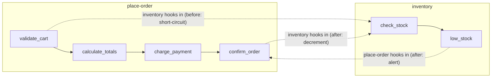

# Feature-First Architecture — Advanced

Extends the basic feature-first pattern (features as directories, each a pipeline of hookable named nodes). Reach for these only when the basics aren't enough: when features need to hook into *each other* as equals, or when the middleware set must change per request. If you don't need that, stay on the basic pattern.

## Full Middleware Capabilities

At any node's hook points, any code (including other features) can:

| Capability        | Description                                | Example                                          |
|-------------------|--------------------------------------------|--------------------------------------------------|
| **Observe**       | Read context without changing it           | Log cart contents at `validate_cart`             |
| **Modify**        | Alter context before or after the node     | Add a loyalty discount at `calculate_totals`     |
| **Short-circuit** | Abort the pipeline from a hook             | Fraud detector aborts at `validate_cart`         |
| **Side-effect**   | Trigger external actions from an after-hook| Send a webhook after `confirm_order`             |

## Dynamic (Runtime) Binding

Static bindings (config-time) express the system's architecture. **Dynamic** bindings attach or detach during execution based on conditions, user context, feature flags, or business rules — letting the same architecture adapt per request, customer, or environment.

```
runtime
  -- seasonal: attach holiday pricing only during promotions
  if promotion.is_active("holiday-sale")
    handle = bind holiday_pricing -> place-order.calculate_totals.before
  ...
  unbind handle

  -- per-customer: attach fraud check only for flagged accounts
  if ctx.customer.risk_level > medium
    handle = bind fraud -> place-order.charge_payment.before
    run place-order
    unbind handle
```

Document runtime-bound hooks in the feature's CLAUDE.md alongside the static ones, so an agent knows which hooks may or may not be present at a given node.

## Features As Peers — Bi-Directional Composition

There is no distinction between "a feature" and "an external," and no caller/callee hierarchy. Every feature is simultaneously a pipeline **and** middleware for other features. If feature A hooks into feature B, B can equally hook into A. Features are peers, not layers.

```
feature place-order
  node confirm_order
    action: persist order, assign order number

  -- place-order acts as middleware for inventory
  hook inventory.low_stock.after
    if ctx.item in pending_orders
      notify_customer("item may be delayed", ctx.item)

feature inventory
  node check_stock
    action: query warehouse levels
  node low_stock
    action: flag items below threshold

  -- inventory acts as middleware for place-order
  hook place-order.validate_cart.before
    for item in ctx.cart.items
      if not in_stock(item)
        abort("item unavailable: " + item.name)

  hook place-order.confirm_order.after
    for item in ctx.order.items
      decrement_stock(item)
```

Both features stay autonomous — each owns its pipeline — but they participate in each other's action points. The relationship is symmetric, and no feature owns another.



The result is the opposite of a layered or tree architecture: a **graph of features** connected through exposed nodes. Each declares its own pipeline and which nodes of other features it participates in.

## What the CLAUDE.md adds at this tier

Beyond the basic contract, a feature using the advanced pattern documents:

- **Outbound hooks** — which nodes of *other* features this feature hooks into
- **Dynamic hooks** — runtime-bound hooks and their conditions (e.g. `holiday_pricing`, `fraud`), not just static wiring
