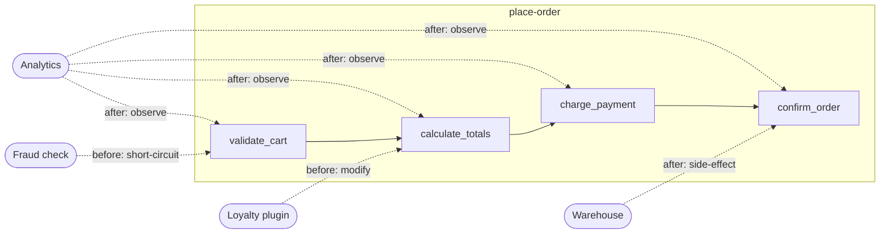
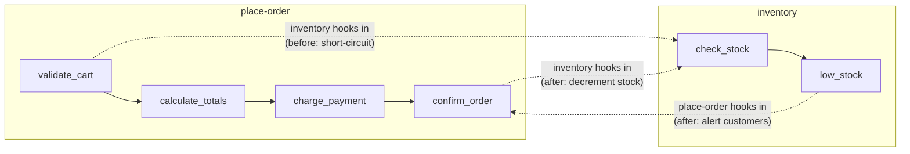

# Feature-First Structured Architecture

## Core Principle

Organize code per feature. Each feature is not a black box with input/output — it is a **pipeline of named nodes**, where each node is an observable, hookable action point.

## Node Anatomy

Every node in a feature pipeline has:

- **Name** — a unique identifier within the feature (e.g. `validate_cart`)
- **Input context** — the data flowing into this step
- **Action** — the node's own logic
- **Output context** — the data flowing out
- **Hook points** — `before` and `after` — where externals attach

## Features As Peers

There is no distinction between "a feature" and "an external." Every feature is simultaneously a pipeline **and** potential middleware for other features. This is bi-directional — if feature A hooks into feature B, feature B can equally hook into feature A. Features are peers, not layers.

## Middleware Binding

Hooks are attached in one of two ways:

**Static (config-time)** — wired during setup, always active for the lifetime of the system. These represent structural relationships between features.

```
config
  bind inventory -> place-order.validate_cart.before     [static]
  bind analytics -> place-order.*.after                  [static]
```

**Dynamic (runtime)** — attached or detached during execution based on conditions, user context, feature flags, or business rules. These allow the feature graph to reshape itself at runtime.

```
runtime
  -- seasonal: attach holiday pricing only during promotions
  if promotion.is_active("holiday-sale")
    handle = bind holiday_pricing -> place-order.calculate_totals.before
  ...
  unbind handle

  -- per-customer: attach fraud check only for flagged accounts
  if ctx.customer.risk_level > medium
    handle = bind fraud -> place-order.charge_payment.before
    run place-order
    unbind handle
```

Static bindings are declared once and express the system's architecture. Dynamic bindings let the same architecture adapt to context — a pipeline's middleware set can differ per request, per customer, or per environment.

## Middleware Capabilities

At any node's hook points, any code (including other features) can:

| Capability       | Description                                                      | Example                                              |
|------------------|------------------------------------------------------------------|------------------------------------------------------|
| **Observe**      | Read the context without changing it                             | Log the cart contents at `validate_cart`              |
| **Modify**       | Alter the context before or after the node runs                  | Add a loyalty discount at `calculate_totals`          |
| **Short-circuit**| Abort the pipeline from a hook                                   | Fraud detector aborts at `validate_cart`              |
| **Side-effect**  | Trigger external actions from an after-hook                      | Send a webhook notification after `confirm_order`     |

## Example: `place-order` Feature

```
feature place-order
  node validate_cart
    before: hooks can reject invalid state, add custom validation rules
    action: check items in stock, validate quantities
    after:  hooks observe validated cart

  node calculate_totals
    before: hooks can inject discounts, tax overrides, currency conversion
    action: sum line items, apply taxes
    after:  hooks observe final totals

  node charge_payment
    before: hooks can swap payment provider, add fraud check
    action: call payment gateway
    after:  hooks observe payment result, trigger receipts

  node confirm_order
    before: hooks can enrich order with metadata
    action: persist order, assign order number
    after:  hooks trigger fulfillment, notifications, analytics
```

### How externals hook in

```
-- A loyalty plugin modifies context at calculate_totals
hook place-order.calculate_totals.before
  ctx.discounts.add("loyalty", lookup_loyalty_discount(ctx.customer))

-- A fraud system short-circuits at validate_cart
hook place-order.validate_cart.before
  if fraud_score(ctx.customer) > threshold
    abort("flagged for review")

-- Analytics observes every node (read-only)
hook place-order.*.after
  emit_metric(node.name, ctx.duration, ctx.result)

-- Warehouse triggers a side-effect after confirm_order
hook place-order.confirm_order.after
  warehouse.reserve(ctx.order.items)
```

## Pipeline Flow



## Bi-Directional Composition

Features hook into each other as equals. There is no caller/callee hierarchy — each feature is middleware for the others.

```
feature place-order
  node confirm_order
    action: persist order, assign order number

  -- place-order acts as middleware for inventory
  hook inventory.low_stock.after
    if ctx.item in pending_orders
      notify_customer("item may be delayed", ctx.item)

feature inventory
  node check_stock
    action: query warehouse levels

  node low_stock
    action: flag items below threshold

  -- inventory acts as middleware for place-order
  hook place-order.validate_cart.before
    for item in ctx.cart.items
      if not in_stock(item)
        abort("item unavailable: " + item.name)

  hook place-order.confirm_order.after
    for item in ctx.order.items
      decrement_stock(item)
```

Both features remain autonomous — each owns its own pipeline — but they participate in each other's action points. The relationship is symmetric: `inventory` is middleware for `place-order`, and `place-order` is middleware for `inventory`.



## Feature Contracts (CLAUDE.md per feature)

Each feature directory contains a `CLAUDE.md` that documents its contract — what the feature provides, what it expects, and how to participate. This serves as the manifest for AI agents working with the codebase.

A feature's CLAUDE.md should contain:

- **Nodes** — each node's name, what context keys it expects (with types), what it produces, and hook guidance (when to use `before` vs `after`)
- **Context keys table** — who writes each key, who reads it, and the type
- **Existing hooks** — what other features have already wired into this feature's nodes
- **Outbound hooks** — what nodes of other features this feature hooks into
- **How to add behavior** — a concrete code example, plus constraints ("do NOT set `total` directly — add to `discounts`")
- **Public surface** — the entry-point function (e.g., `definePlaceOrder(engine)`)
- **Owns / Does not own** — explicit boundary: what this feature handles vs what it delegates to hooks or other features
- **Dynamic hooks** — runtime-bound hooks, not just static wiring (e.g., `holiday_pricing`, `fraud`)

For small features (≤2 nodes, contract ≤40 lines), a single CLAUDE.md is sufficient. For larger features (3+ nodes), split into a slim CLAUDE.md (always loaded, ~15 lines) and a CLAUDE_full.md (on-demand, full contract). See the two-tier CLAUDE.md pattern for details.

If the project also uses a cards system, per-feature content lives exclusively in the co-located CLAUDE.md/CLAUDE_full.md. Cards are reserved for cross-cutting documentation.

```
features/
  place_order/
    place_order.dart       ← pipeline definition
    CLAUDE.md              ← contract: nodes, context keys, existing hooks
  inventory/
    inventory.dart
    CLAUDE.md
```

The CLAUDE.md replaces formal type schemas with natural-language contracts. An agent reads the CLAUDE.md to know what keys are available at each node, what types they are, and how to participate — without reading the implementation. The engine's execution trace provides runtime verification that the hook actually fired where expected.

This is intentionally soft. The contracts are maintained alongside the code, not enforced by the type system. For agentic development this is sufficient: the agent reads the contract, writes the hook, and verifies via the trace.

## Feature Graph

The result is not a tree of modules or a layered architecture — it is a **graph of features** connected through their exposed nodes. Each feature declares its own pipeline and declares which nodes of other features it participates in. No feature "owns" another.

```
feature returns
  node validate_return
    action: check return eligibility

  node refund
    action: process refund

  -- returns hooks into place-order and inventory as middleware
  hook place-order.confirm_order.after
    if ctx.order.is_returnable
      register_return_window(ctx.order)

  hook inventory.check_stock.after
    if ctx.has_pending_return
      ctx.available += ctx.return_quantity
```
