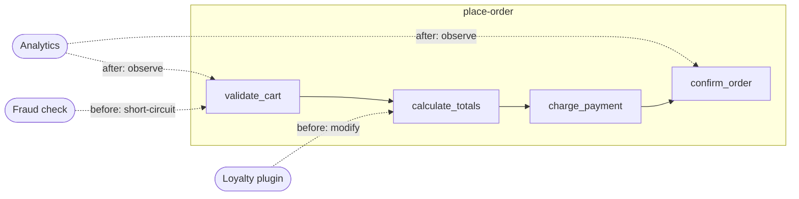

# Feature-First Structured Architecture

Organize code per feature, one directory each. Inside, a feature is a **pipeline of named nodes** — each node an observable, hookable step rather than an opaque function call.

## Layout

```
features/
  place_order/
    place_order.dart       ← pipeline definition
    CLAUDE.md              ← contract: nodes, context keys, hooks
  inventory/
    inventory.dart
    CLAUDE.md
```

One feature = one directory = one pipeline. Its `CLAUDE.md` is the contract.

## Node Anatomy

Every node in a pipeline has:

- **Name** — unique within the feature (e.g. `validate_cart`)
- **Input context** — data flowing in
- **Action** — the node's own logic
- **Output context** — data flowing out
- **Hook points** — `before` and `after` — where other code attaches

## Hooks

Other code (including other features) attaches at a node's `before`/`after` points to observe context, modify it, or short-circuit the pipeline. Wire them once at config time:

```
config
  bind inventory -> place-order.validate_cart.before
  bind analytics -> place-order.*.after
```

## Example: `place-order` Feature

```
feature place-order
  node validate_cart
    before: hooks can reject invalid state, add validation rules
    action: check items in stock, validate quantities
    after:  hooks observe validated cart

  node calculate_totals
    before: hooks can inject discounts, tax overrides
    action: sum line items, apply taxes
    after:  hooks observe final totals

  node charge_payment
    before: hooks can swap payment provider, add fraud check
    action: call payment gateway
    after:  hooks observe payment result, trigger receipts

  node confirm_order
    before: hooks can enrich order with metadata
    action: persist order, assign order number
    after:  hooks trigger fulfillment, notifications, analytics
```

### How externals hook in

```
-- A loyalty plugin modifies context at calculate_totals
hook place-order.calculate_totals.before
  ctx.discounts.add("loyalty", lookup_loyalty_discount(ctx.customer))

-- A fraud system short-circuits at validate_cart
hook place-order.validate_cart.before
  if fraud_score(ctx.customer) > threshold
    abort("flagged for review")

-- Analytics observes every node (read-only)
hook place-order.*.after
  emit_metric(node.name, ctx.duration, ctx.result)
```



## Feature Contract (CLAUDE.md per feature)

Each feature directory holds a `CLAUDE.md` documenting its contract — what the feature provides, what it expects, how to participate. An agent reads it to learn what context keys exist at each node and how to hook in, without reading the implementation.

A feature's CLAUDE.md should contain:

- **Nodes** — each node's name, what context keys it expects (with types), what it produces, and `before` vs `after` guidance
- **Context keys table** — who writes each key, who reads it, the type
- **Existing hooks** — what other features have wired into this feature
- **How to add behavior** — a concrete code example, plus constraints ("do NOT set `total` directly — add to `discounts`")
- **Public surface** — the entry-point function (e.g. `definePlaceOrder(engine)`)
- **Owns / Does not own** — what this feature handles vs what it delegates

The contract replaces formal type schemas with natural-language description: soft, co-located with the code, and enough for an agent to write a hook and verify via the engine's execution trace that it fired where expected.

For larger features (3+ nodes), split the contract into a slim always-loaded CLAUDE.md plus an on-demand full version (the two-tier CLAUDE.md pattern).

When the project also uses a cards system, per-feature content lives only in the co-located CLAUDE.md — cards are reserved for cross-cutting documentation.

---

The advanced version of this pattern — features as bidirectional peers, runtime-bound (dynamic) hooks, and the full middleware capability model — lives in the **feature-first-advanced** card. Start here; reach for that only when features genuinely need to hook into each other or reshape the graph per request.
