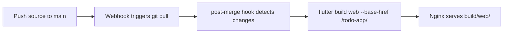

# Todo App

A Flutter web frontend for the [Todo API](../todo-api/).

**Live:** [https://ai.memention.net/todo-app/](https://ai.memention.net/todo-app/)

## Features

- User signup and login with email/password
- Create, edit, and delete todos
- Mark todos as done/undone with checkboxes
- Drag-and-drop reordering
- Responsive Material 3 design with light/dark theme support
- Persistent login via local storage

## Architecture

- **State management:** Provider (ChangeNotifier)
- **API communication:** `http` package with relative URLs (served behind same nginx)
- **Auth:** JWT tokens stored in SharedPreferences

## Project structure

```
lib/
├── main.dart                 # Entry point
├── app.dart                  # MaterialApp with theme and auth routing
├── models/
│   └── todo.dart             # Todo data model
├── services/
│   └── api_service.dart      # HTTP client for todo-api
├── providers/
│   ├── auth_provider.dart    # Authentication state
│   └── todo_provider.dart    # Todo list state
├── screens/
│   ├── login_screen.dart     # Login / signup form
│   └── todo_list_screen.dart # Main todo list with reordering
└── widgets/
    ├── todo_tile.dart        # Individual todo card
    ├── add_todo_dialog.dart  # New todo dialog
    └── edit_todo_dialog.dart # Edit todo dialog
```

## Build

Build output (`build/`) is **gitignored** and built on the server automatically.



The `--base-href /todo-app/` flag is applied automatically by the post-merge hook.
CI (`.github/workflows/build-flutter-web.yml`) validates the build on push/PR but does not deploy.

**To build manually on the server:**
```bash
cd projects/todo-app
flutter pub get
flutter build web --base-href /todo-app/ --release
```

> **⚠️ Do not commit `build/` to git.** It is gitignored. Agents must not build or commit build output.

## Nginx

The app is served as static files at `/todo-app/`:

```nginx
location /todo-app/ {
    alias /home/epatel/vps-ai/projects/todo-app/build/web/;
    index index.html;
    try_files $uri $uri/ /todo-app/index.html;
}
```

API requests use relative paths (`/todo-api/...`) so they go through the same
nginx instance — no CORS issues.
